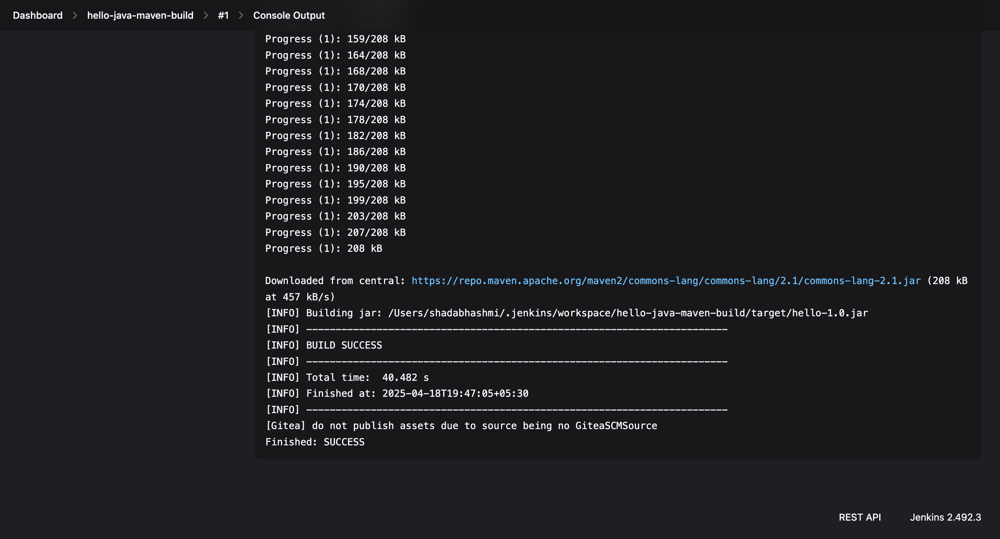
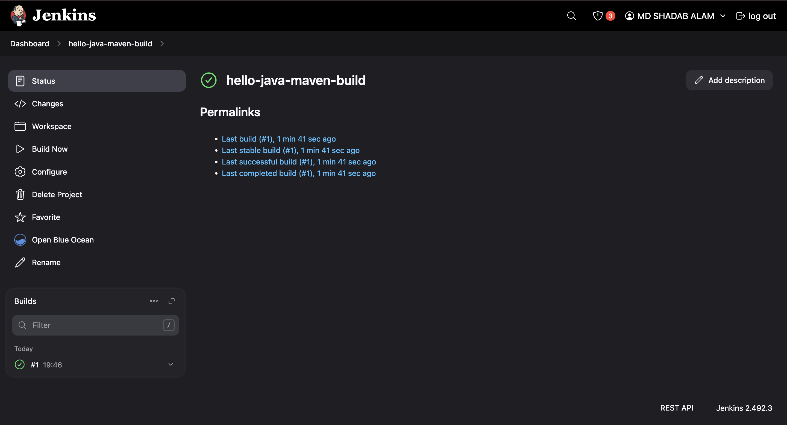
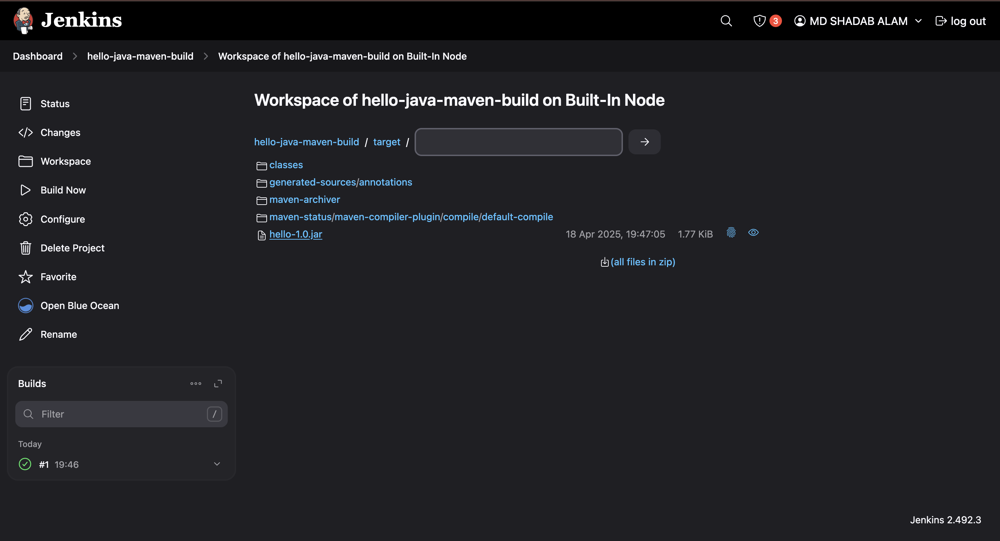

# Java Maven Jenkins
A simple Java project demonstrating CI/CD with Jenkins and Maven. This project shows how to set up a basic Jenkins pipeline to build a Java application using Maven.

## Prerequisites

- Java JDK 8 or 11
- Apache Maven 3.8.6+
- Jenkins (with Maven plugin)
- Git (optional)

## Setup Instructions

### 1. Create Project Files

```bash
mkdir -p hello-java-maven/src/main/java
cd hello-java-maven
```
### 2. Create src/main/java/HelloWorld.java

```bash
public class HelloWorld {
    public static void main(String[] args) {
        System.out.println("Hello, Jenkins + Maven!");
    }
}
```
### 3. Create pom.xml

```bash
<project>
    <modelVersion>4.0.0</modelVersion>
    <groupId>com.example</groupId>
    <artifactId>hello</artifactId>
    <version>1.0</version>
    <build>
        <plugins>
            <plugin>
                <groupId>org.apache.maven.plugins</groupId>
                <artifactId>maven-compiler-plugin</artifactId>
                <version>3.8.1</version>
                <configuration>
                    <source>1.8</source>
                    <target>1.8</target>
                </configuration>
            </plugin>
        </plugins>
    </build>
</project>
```
## Jenkins Setup
### 1. Access Jenkins
- Open a browser and go to http://localhost:8080
- Unlock Jenkins using the initial admin password (found in the console output or at /var/jenkins_home/secrets/initialAdminPassword)
- Complete the setup wizard, installing suggested plugins

### 2. Install Maven Integration plugin
- Go to "Manage Jenkins" → "Manage Plugins"
- Select the "Available" tab
- Search for "Maven Integration" plugin
- Install it and restart Jenkins if required

### 3. Configure Maven
- Go to "Manage Jenkins" → "Global Tool Configuration"
- Under "Maven", click "Add Maven"
- Name it "Maven 3.8.6"
- Check "Install automatically" and select version 3.8.6
- Save the configuration

### 4. Create a Freestyle Project
- Click "New Item" on the Jenkins dashboard
- Enter a name like "hello-java-maven-build"
- Select "Freestyle project"
- Click "OK"

### 5. Configure source code management
- In the project configuration:
    If using Git: Select "Git" and enter your repository URL

### 6. Add build step
- Under "Build", click "Add build step"
- Select "Invoke top-level Maven targets"
- In "Maven Version", select "Maven 3.8.6"
- In "Goals", enter clean package
- Save the configuration

### 7. Run the Build
- From the project page, click "Build Now"
- The build will start and appear in the "Build History" section

### 8. View console output
- Click on the build number in the Build History
- Click "Console Output" to see the detailed build process
- You should see output ending with BUILD SUCCESS

### 9. Verify the Build
- In the build workspace, verify that:

    - target/hello-1.0.jar was created

    - The build was successful

## Screenshot Examples




